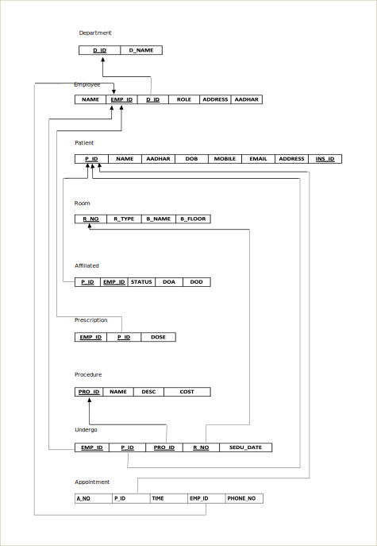
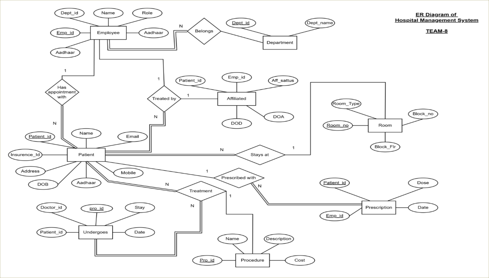
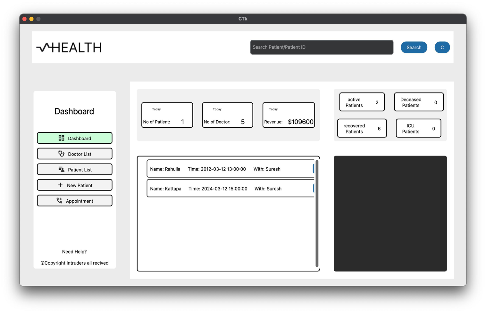
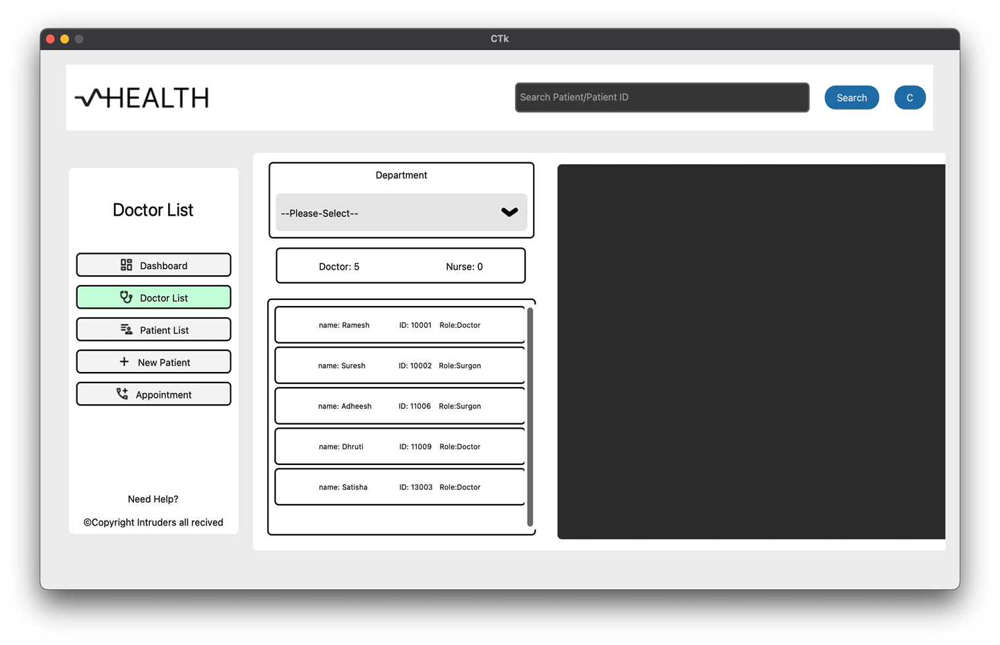
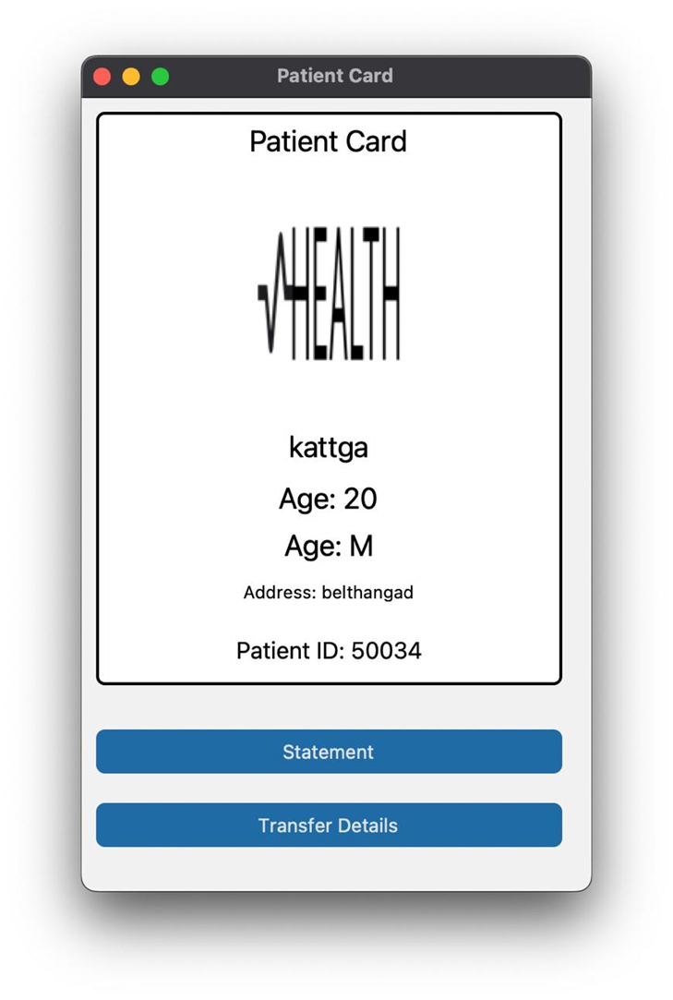
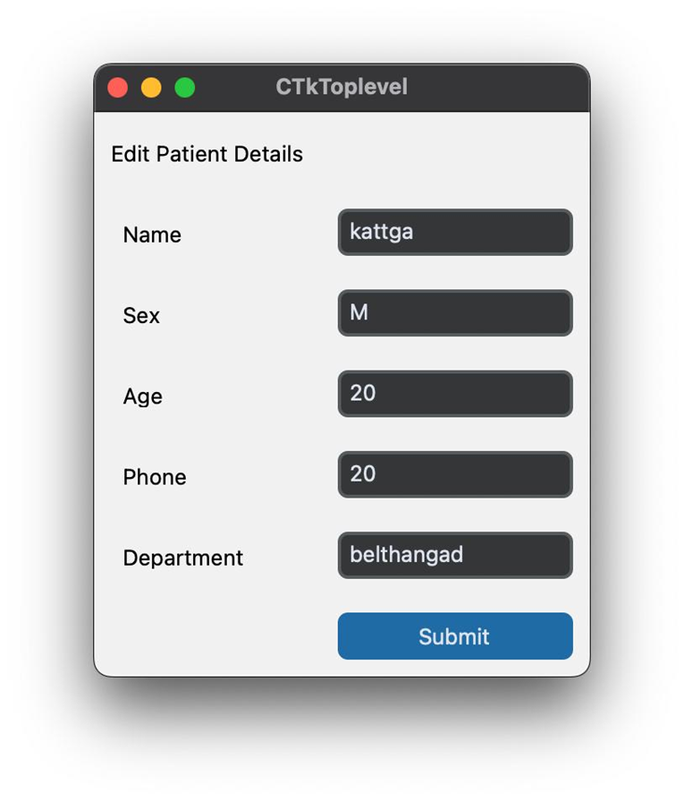
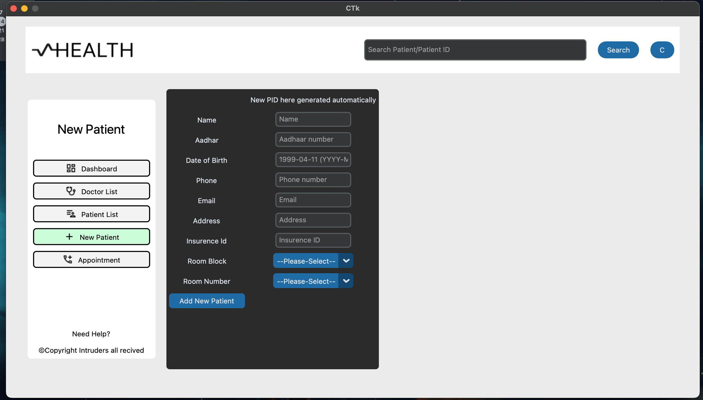
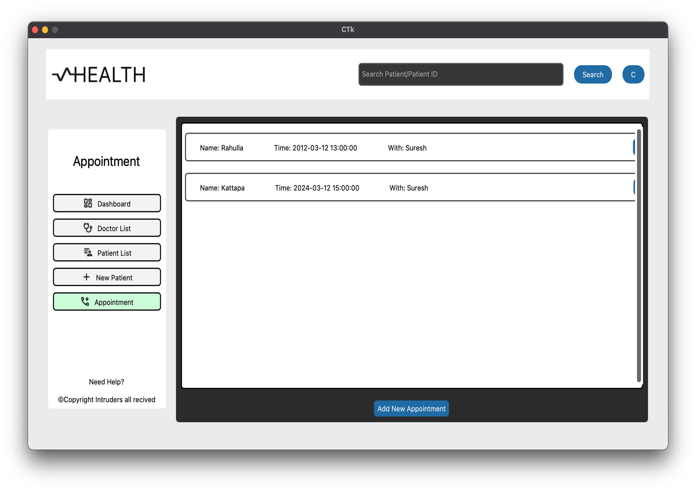

# Hospital Management System

Please enter this command in the terminal in the same workspace as this project is in your local system
`pip install -r requirements.txt`

This Project was a mini Project done in 5th sem of our Engineering.

### Project Members:

1. **Samartha J**
2. **Ashwath Bhat**
3. **Shreyas V**
4. **Chandan R**

### Project Description: 

Hospital Management System is designed to streamline the workflow of hospital management by providing efficient tools for adding new patients and doctors, retrieving detailed information about them, and scheduling appointments with ease. The system allows for seamless creation of appointments using the "Add Appointment" feature, ensuring that hospital operations run smoothly and effectively.

The Hospital Management System is a project made entirely with Python to help hospitals run more smoothly. The system’s front end, or the part that users see and interact with, is built using the CustomTkinter library, which makes it easy for hospital staff to manage patient and doctor records. All the important details, like medical histories and contact information, are safely stored and easy to access. The back-end, or the part that handles the system’s logic and processing, is also done in Python, ensuring everything works well together.

To connect the Python application with the SQL database, the project uses the MySqlConnector library. This allows the system to securely store, retrieve, and manage data. The system also includes a simple tool for scheduling appointments, helping to organize doctors’ schedules and avoid conflicts, which improves the flow of patients through the hospital.

Data security is a priority, so all sensitive information is kept safe and follows the necessary rules to protect privacy. The system can be customized to fit the needs of any hospital, whether it’s large or small, and it can grow as those needs change. It also includes tools to generate reports that help hospital management see how well things are running, track patient outcomes, and monitor staff performance. Overall, the Hospital Management System makes hospital management easier, improves patient care, and securely handles all important data, all powered by Python.

Note: This project is still a work in progress and is missing some features. However, the current version includes all the essential features needed for a basic Hospital Management System.

## Snapshots

### Database Schema diagram

Note: This project is still a work in progress and may be missing some tables, as certain elements were rejected during development by the guide.

### ER diagram

### Dashboard

### Doctor List view

### Patient List view

### Patient Card

### Patient Edit

### New Patient

### Appointment view

